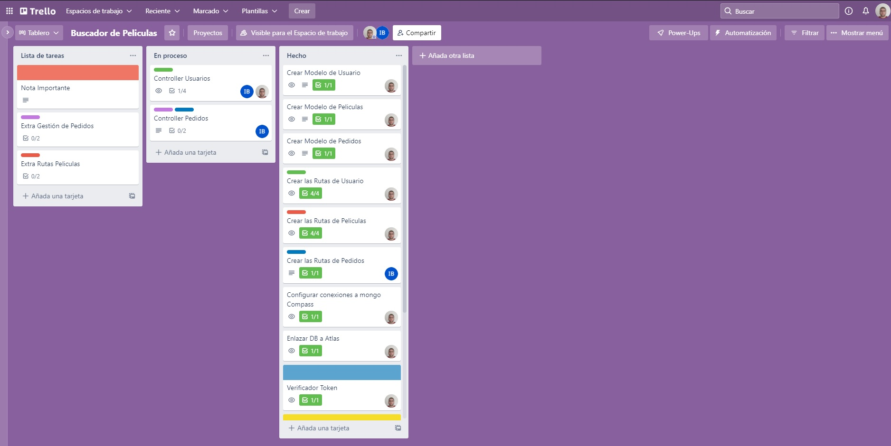

# Base de datos Videoclub
---
Para este proyecto se nos pidió que crearamos una DataBase(con una gestion de datos a escoger) para un "videoclub". Nosotros
elegimos como gestion de datos MongoDB. 

---
# Trabajo Realizado
---

Lo primero que hicimos fue juntarnos y crear en Trello las tablas y las diferentes tareas a realizar. Una vez tuvimos claro el
proceso a seguir, nos fuimos repartiendo las diferentes tareas.

Foto de Ejemplo

Una vez acabamos todo el trabajo, repasamos que los controladores y las rutas esten bien. A continuacion, deployamos en Heroku la 
base de datos, que ya estaba vinculada a Mongo Atlas.

---

# Deploy en Heroku 
---

[Link del proyecto en heroku](https://proyecto-bucador-peliculas.herokuapp.com/) 🌎

---

# Instrucciones y endpoints

---

- Abrir el link de heroku para arrancar automáticamente el servidor. 

- Pasamos a postman donde copiaremos también el mismo link para empezar a lanzar peticiones.

---

## Endpoints

---

<h2>Usuarios</h2>

* "/api/register" para registrarnos como usurarios.

 

* "/api/login" para loggearnos como usuarios

 

* "/api/users/profile" con este Endpoint veríamos la informacion de usuarios (Solo "boss")

 

* "/api/deleteUser" los mismos usuarios pueden darse de baja

---

<h2>Películas</h2>

---

* "/api/movies" para buscar todas las peliculas

 

* "/api/movies/:id" para buscar una pelicula a través de su id.

 

* "/api/movies/title/:title" para buscar una pelicula a traves de su titulo

 

* "/api/movies/genre/:genre" para buscar las películas a traves del género

 

* "/api/movies/actors/:actors" para buscar las películas por medio de los actores

 

* "/api/movies/create" este Endpoint solo lo puede usar el "boss", y se utiliza para crear una  película

 

* "/api/movies/delete/:id" este Endpoint solo lo puede usar el "boss", y se utiliza para eliminar una  película

 

---

<h2>Pedidos</h2>

---

* "/api/orders/create" en este Endpoint, solo los usuarios registrados, pueden hacer un pedido

 

* "/api/orders" donde solo el "boss" puede buscar los pedidos

 

* "/api/orders/:id" donde solo el "boss" puede buscar los pedidos por su id

 

* "/api/orders/delete" en este Endpoint, solo los usuarios registrados, pueden eliminar su pedido